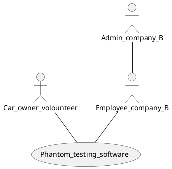
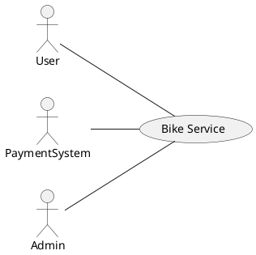
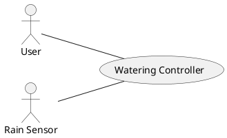
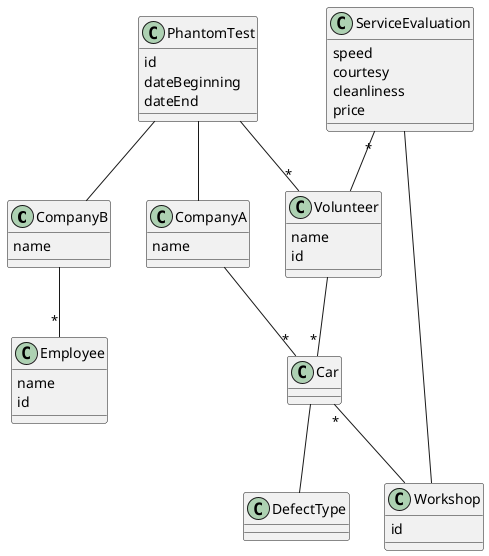
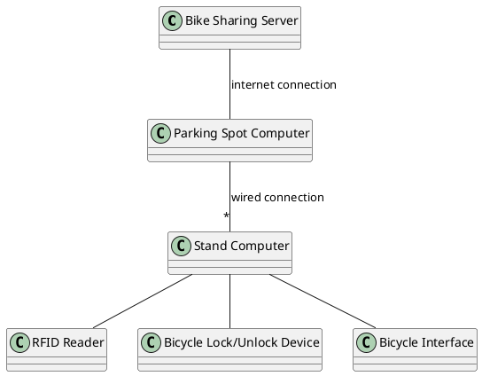
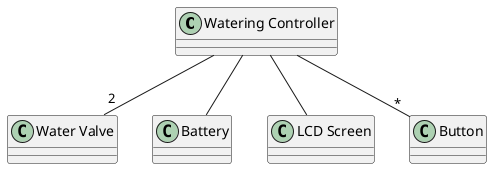

# Esercizi Esame

## Context Diagram

### 2/10/2017

|     Actor      | Physical Interface  | Logical Interface |
| :------------: | :-----------------: | :---------------: |
| Car owner volounteer | PC | GUI |
| Admin company B | PC | GUI |
| Employee company B | PC | GUI |

### 27/06/16

|     Actor      | Physical Interface  | Logical Interface |
| :------------: | :-----------------: | :---------------: |
|      User      |   Smartphone, PC    |        GUI        |
|     Admin      |         PC          |        GUI        |
| Payment System | Internet Connection |  SSL, HTTPS, API  |

Admin potrebbe estendere User, ma non c'è modo di saperlo (no correzione)

### 07/09/15

|    Actor    |   Physical Interface    |            Logical Interface            |
| :---------: | :---------------------: | :-------------------------------------: |
|    User     |     Buttons, screen     |              Screen shots               |
| Rain Sensor | Bipolar Connector 0-3 V | Boolean (open = rain, closed = no rain) |

## Glossary (UML Diagram)

### 2/10/2017

## Requirements (FR, NFR)

## System Design

Solo entità fisiche (computer, connessioni, altri strumenti informatici)

### 27/06/16

### 07/09/15

## Scenarios

## Black Box Testing

Valid/Invalid dipende dai valori in input, si ha NV se anche solo uno dei valori non è accettabile
Se la funzione da testare prevede calcoli con i parametri in base ai quali decide il risultato e i parametri sono tutti validi

### 18/07/16

|  nLuggage   |   length1   | width1 | depth1 | weight1 | length2 | width2 | depth2 | weight2 | totalDim1 | totalDim2 | totalWeight | Valid/Invalid |      Test Case       |
| :---------: | :---------: | :----: | :----: | :-----: | :-----: | :----: | :----: | :-----: | :-------: | :-------: | :---------: | :-----------: | :------------------: |
| [minint, 0[ |      -      |   -    |   -    |    -    |    -    |   -    |   -    |    -    |     -     |     -     |      -      |      NV       | (-1,0,0,0,0,0,0,0,0) |
|      0      |      -      |   -    |   -    |    -    |    -    |   -    |   -    |    -    |     -     |     -     |      -      |       V       | (0,0,0,0,0,0,0,0,0)  |
|      1      | [minint, 0] |   -    |   -    |    -    |    -    |   -    |   -    |    -    |     -     |     -     |      -      |      NV       | (1,-1,0,0,0,0,0,0,0) |
|      "      | [1, maxint] |        |        |         |         |        |        |         |           |           |             |               |                      |
E poi continua ma non sono un pazzo

### 27/06/16

|   duration   |   minRate   |  minRate2   | Valid/Invalid |      Test Case      |
| :----------: | :---------: | :---------: | :-----------: | :-----------------: |
| [minint, 0[  | [minint, 0[ | [minint, 0[ |      NV       |    (-1, -1, -1)     |
|              |             | [0, maxint] |      NV       |     (-1, -1, 5)     |
|              | [0, maxint] | [minint, 0[ |      NV       |     (-1, 5, -1)     |
|              |             | [0, maxint] |      NV       |     (-1, 5, 5)      |
|   [0, 30]    | [minint, 0[ | [minint, 0[ |      NV       |    (10, -1, -1)     |
|              |             | [0, maxint] |      NV       |     (10, -1, 5)     |
|              | [0, maxint] | [minint, 0[ |      NV       |    (10, 10, -1)     |
|              |             | [0, maxint] |       V       |  (10, 5, 3)  = 0.0  |
|              |             |             |               |  (0, 5, 3)  = 0.0   |
|              |             |             |               |  (1, 5, 3)  = 0.0   |
|              |             |             |               |  (30, 5, 3)  = 0.0  |
|   [31, 90]   | [minint, 0[ | [minint, 0[ |      NV       |    (31, -1, -1)     |
|              |             | [0, maxint] |      NV       |    (31, -1, 10)     |
|              | [0, maxint] | [minint, 0[ |      NV       |    (31, 5, -10)     |
|              |             | [0, maxint] |       V       | (31, 10, 10) = 0.1  |
|              |             |             |               | (40, 10, 10) = 1.0  |
|              |             |             |               | (90, 10, 10) = 6.0  |
| [91, maxint] | [minint, 0[ | [minint, 0[ |      NV       |    (91, -1, -1)     |
|              |             | [0, maxint] |      NV       |    (91, -1, 10)     |
|              | [0, maxint] | [minint, 0[ |      NV       |    (91, 10, -1)     |
|              |             | [0, maxint] |       V       | (91, 10, 10) = 6.1  |
|              |             |             |               | (100, 10, 10) = 8.0 |
|              |             |             |               | (100, 0, 10) = 1.0  |
|              |             |             |               | (100, 10, 0) = 6.0  |

### 07/09/15

|    side1    |    side2    |    side3    | triangle? | equal sides | position of equals | Valid/Invalid |   Test Cases   |
| :---------: | :---------: | :---------: | :-------: | :---------: | :----------------: | :-----------: | :------------: |
| [minint, 0] | [minint, 0] | [minint, 0] |     -     |      -      |         -          |      NV       |  (-1, -1, -1)  |
|             |             | [1, maxint] |     -     |      -      |         -          |      NV       |  (-1, -1, 2)   |
|             | [1, maxint] | [minint, 0] |     -     |      -      |         -          |      NV       |  (-1, 2, -1)   |
|             |             | [1, maxint] |     -     |      -      |         -          |      NV       |   (-1, 2, 2)   |
| [1, maxint] | [minint, 0] | [minint, 0] |     -     |      -      |         -          |      NV       |  (1, -1, -1)   |
|             |             | [1, maxint] |     -     |      -      |         -          |      NV       |   (1, -1, 3)   |
|             | [1, maxint] | [minint, 0] |     -     |      -      |         -          |      NV       |   (1, 2, -1)   |
|             |             | [1, maxint] |     F     |      -      |         -          |       V       | (1, 1, 2) = -1 |
|             |             |             |     T     |      0      |         -          |       V       | (3, 4, 5) = 3  |
|             |             |             |     T     |      3      |        AAA         |       V       | (1, 1, 1) = 1  |
|             |             |             |     T     |      2      |        AAB         |       V       | (1, 1, 3) = 2  |
|             |             |             |     T     |      2      |        ABA         |       V       | (1, 3, 1) = 2  |
|             |             |             |     T     |      2      |        BAA         |       V       | (3, 1, 1) = 2  |

## White Box Testing

### 18/07/16

Come minchia si decide la Path coverage?

|   Coverage Type    | Test Cases Needed for 100% Coverage | Coverage Obtained with defined TCs |           Test Cases Defined            |
| :----------------: | :---------------------------------: | :--------------------------------: | :-------------------------------------: |
|        Node        |                  2                  |                100%                |                TC1, TC2                 |
|        Edge        |                  2                  |                100%                |                TC1, TC2                 |
| Multiple Condition |                  4                  |                100%                |                TC1 (TT)                 |
|                    |                                     |                                    |                 TC2(FF)                 |
|                    |                                     |                                    |                 TC3(TF)                 |
|                    |                                     |                                    |                 TC4(FT)                 |
|        Loop        |                  3                  |                100%                | TC1(1 loop), TC2(no loop), TC3(2 loops) |
|        Path        |                                     |                                    |                                         |

TC1 = (-4, -1, -5);
TC2 = (3, 0, 3);
TC3 = (-3, -2, -1);
TC4 = (1, 0, 0);

### 27/06/16

|   Coverage Type    |              Test Cases Needed for 100% Coverage              | Coverage Obtained with defined TCs | Test Cases Defined |
| :----------------: | :-----------------------------------------------------------: | :--------------------------------: | :----------------: |
|        Node        |                               1                               |                100%                |        TC1         |
|        Edge        |                               1                               |                100%                |        TC1         |
| Multiple Condition | Not possible (one condition doesn't depend on input values)NO |                100%                |      TC1 (TF)      |
|                    |                               2                               |                                    |      TC2(TT)       |
|                    |                                                               |                                    |   TC1 iter7(FF)    |
|                    |                                                               |                                    |   TC1 iter7(FT)    |
|        Loop        |                               3                               |   33% can't force one/zero iters   |    TC1 6 times     |
|        Path        |                 4^6 = 2^12 <= 4096 if g6 < 34                 |                                    |                    |

TC1 = (18, 20, 19, 18, 20, 19);
TC2 = (18, 27, 30, 21, 29, 36);

### 07/09/15

|   Coverage Type    |  Test Cases Needed for 100% Coverage  | Coverage Obtained with defined TCs |       Test Cases Defined        |
| :----------------: | :-----------------------------------: | :--------------------------------: | :-----------------------------: |
|        Node        |                   3                   |                100%                |          TC1, TC2, TC3          |
|        Edge        |                   4                   |                100%                |       TC1, TC2, TC3, TC4        |
| Multiple Condition |  Not Feasible (no multiple cons) ERR  |                                    |                                 |
|                    |             2 are enough              |                100%                |               TC1               |
|                    |                                       |                                    |                                 |
|                    |                                       |                                    |                                 |
|        Loop        |                   3                   |  33% (can't force one/zero iters)  | TC1 3 times (any input is fine) |
|        Path        | 2^3 *4 = 32     ERR (overall 4 paths) |                                    |                                 |

TC1(10000)
TC2(20000)
TC3(40000)
TC4(1000)

## Note di Teoria Varie

- Differences between iterable and waterfall process? Waterfall only performs one iteration.
- Singleton Design pattern? A class represents a concept that requires a single instance. Only one instance of the class is created.
- Types of defects in a requirements document? Omissions/incompleteness, incorrect facts, inconsistency/contradictions, ambiguity, extraneous information, overspecification in design, redundancy.
- What is an oracle, with its key problems? Given a test case, produces the expected output. Very difficult to have an automatic one, a human oracle is subject to errors; it's based on the program specifications, which can be wrong.
- Exhaustive testing? Trying all possible test cases for a function/class/program. Is normally unfeasible because of the virtually infinite test cases.
- Mutation testing? Evaluating how a test suite is good by injecting errors (mutations) in a program and verifying how many mutations are caught by the test suite.
- Copy - Modify - Merge approach, with pros and cons? Each user creates a working copy of a file. Users work in parallel, modifying their private copies and merging them. Users don't have to wait for one another to work on a file, but there's risk of conflicts arising if they both work on the same part of a file, and conflicts can't be resolved by software but require human intervention.
- Selecting one design according to Functional Requirements? If all designs satisfy Functional Requirements, decision should be based on satisfaction of NON Functional Requirements.
- Key concepts of Scrum? Having a product backlog(list of ordered requirements), working on increments(doing sprints of development, results must be usable), having different planning meetings(daily, sprint planning, sprint review)
- What factors characterize a software process? Number of interactions, sequential vs parallel activities, new development vs maintenance, emphasis on documents.
- What techniques can be used to validate the functional requirements of an application to be built? Inspection of requirements, prototype building, GUI prototype building, writing of acceptance test cases.
- Purpose of "check in" and "check out" operations in Configuration Management? Enforce sequential changes to Configuration Items(if in lock-modify-unlock mode) or support parallel changes(if in copy-modify-merge mode) to avoid inconsistencies.
- Pair programming technique in Xtreme Programming? Two people work on one machine to develop both production code and test cases with one person writing and the other suggesting changes/improvements (roles are often reversed).
- What are the factors to consider in selecting a suitable software process? Criticality(safety critical, mission critical, other), size(correlates to number of developers needed), domain, maintenance vs new development
- What is the difference between ‘correctness’ and ‘reliability’? Correctness is when a program produces the requested output for every input in the input space, reliability is the probability of providing the requested output over a period of time.
- How is versioning implemented in Subversion? All Configuration Items in a configuration inherit version number(which increments by 1) from the configuration.
- Repository architectural style, when can it be used? Subsystems must exchange data, either with shared data in a central database/repository which may be accessed by all subsystems or with each subsystem with its own database, passing data explicitly to other subsystems. It is best used when large amounts of data are to be shared.
- What are the typical states of a Change Request in a maintenance process? Receive Change Requests, filter them(merge similar ones, discard incorrect/unfeasible ones), evaluate impact of Change Requests, rank them(using severity for corrective ones and importance for evolutive ones), assign Change Requests to person/team that will implement them, merge CR with next release of application, release application.
- What is the basic principle of the Visual approach to GUI testing? Graphic components (buttons, menus etc) are recognized via image recognition.
- What is the basic principle of the layout-based scripted approach to GUI testing? Graphic components are identified retrieving their ID(used by the graphic library) or by specific unique properties. 
- Pipeline architectural style, when can it be used? Many modules are connected in sequence, with each module being independent of others and data flowing from one module to the next one as the only way of communication between modules. Used when there's need to process data streams according to several steps.
- In which cases can an Oracle be automatic? If a previous, reliable version of the software application is available or if a function can be expressed mathematically.
- What is the derivation history of a Configuration Item? The history of versions and the changes made in them for the specific CI.
- What is the core content of the ISO 12207 standard? Hierarchical List of activities in the software process.
- What is more relevant for a user between a defect and a failure in a software application? A failure, because the user is exposed to it.
- Problem of interactions in Non Functional Requirements? Some NFR may be in conflict (performance vs security), so it is unfeasible to achieve both and trade-offs are required.
- What are the risks of not using Configuration Management? Concurrent access and inconsistent modifications of CIs, unavailability of past versions of CIs.
- Abstract Factory design style, when can it be used? Can be used when a family of related classes can have different implementation details and the client shouldn't know anything about which variant they're using.
- Weinberg’s law? The creator of a program is unsuitable to test it since because of emotional attachment to its creature the programmer tends to overlook defects in it. 
- Lock - Modify - Unlock approach, with pros and cons? The repository allows only one person at a time to work on a file, with a lock operation needed to work on a file and preventing others to work on it until the release of the lock. May cause delays (locks being kept for a long time, changes that don't overlap can't be done in parallel) and problems of compatibility if two files need to work together and changes ruin this functionality.
- What is a baseline and when is it used? A baseline is a set of Configuration Items in a stable form(compiles correctly, links, passes all regression tests); it's used to deliver an application internally/externally while development continues on the next version.
- Waterfall process, with pros and cons? Document oriented process where activities(requirement/design/implementation/unit test/intergration test/system test) are done in sequence (activity i+1 starts only after activity i is completed). Easy structure of activities and agreement on design allows to allocate tasks to many, distributed workers/companies but delivery to customer and validation of requirements/system happen very late, changes require to restart the process and there's slowness and lack of flexibility.
- What is versioning?  Keeping copy of each instance of a Configuration Item, allowing to keep the history of all modifications to a CI, and the ability to roll back to any past instance of a CI
- What measures can be used to evaluate the quality of software? Fault density, Mean Time Between Failures, user satisfaction (questionnaire).
- Adapter design pattern? A class provides the required features but its interface is not the one required.
- Considering GIT, what are the three project sections that it defines, and how are they used? Git directory(collection of all committed and pushed files, accessible by all users), working directory(cloned directory where users work and implement modifications) and staging area (contains modified files committed but not yet pushed).
- Test Driven Development technique? Write, using requirements, one test case that fails, then write corresponding code until test case passes, repeat until all requirements are satisfied and all test cases pass.
- What are the units of measure for Duration and Effort? Duration is measured in calendar time(hours, days, weeks) and consists in the time needed to complete a project, while effort is measured in person hours and is the amount of work needed.
- Facade Design pattern? A functionality is provided by a complex group of classes, allows to use the classes without being exposed to their details.
- MVC Design pattern? When there's an interactive application with flexible Human Computer Interaction where the same information is presented in different ways and must be consistent, uses a Model to manage state, a View to render on the UI and a Controller to handle events from the UI.
- Key steps in an inspection process of a requirement document? Reading document done by a group of people with the goal of finding (not correcting) defects, which are then communicated to those that wrote the document.
- Delphi estimation method? Structured meetings to achieve consensus in estimate where each participant proposes anonymously an estimate and the team leader then publishes a synthesis of all the estimates. This process is then repeated in an iterative way.

